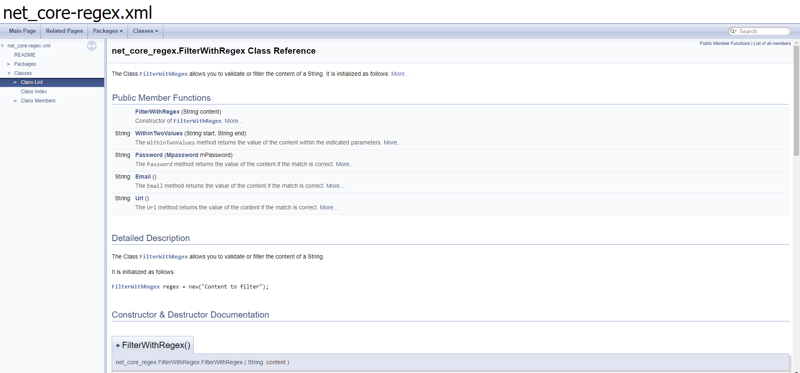

# net_Core-regex
---
This project is made with the [C#](https://docs.microsoft.com/es-es/dotnet/csharp/) programming language with the ide [Visual Studio](https://visualstudio.microsoft.com/es/vs/community/).
 
To see the unit tests and clone them, click on the following link:
 
[Unit test](https://github.com/antonioolvera1995/net_core-regexTests)

 
When you clone the repository you can open the documentation in the path [./Documentation/html/index.html](https://github.com/antonioolvera1995/net_Core-regex/blob/master/Documentation/html/index.html)
 

 

 

